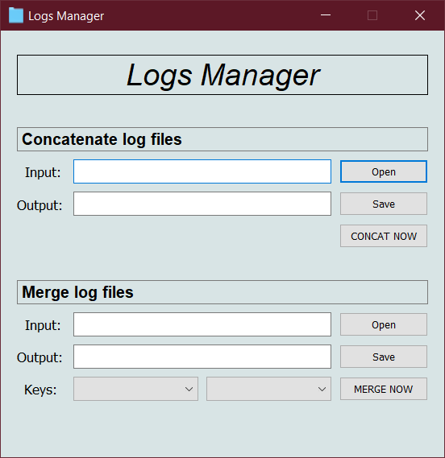

# Logs Manager
### Simple gui app to concatenete or merge (by key) your csv/xlsx/xls files<br>
<p align="center">
  
</p>

### Index

1. [**What is Logs Manager?**](#what-is-logs-manager)
2. [**System Dependencies**](#requirements-and-dependencies)
3. [**Quick Start**](#quick-start)
6. [**Instructions**](#instructions)
7. [**Credits**](#credits)

<ul>


## What is Logs Manager?

**Logs Manager** is an application developed for a "Networks and distributed systems security" exam 
at **Univeristy Aldo Moro** of Taranto Italy. <br>
its goal is to manage log files released from different apps. 
It can be used to concatenete a large ammount of data logs spreads in different CSV/XLS/XLSX files, 
in addiction, it can allow merge two log files using a key (column name) at the same way a databases would do.

### Functionalities
<ul>

<li>
    Concatenete two or more log files : Useful to unify different files into a single one.
</li>
<li>
    Key based merge of two log files : Useful to filter records between two log files.
</li>

</ul>


<li>

## Requirements and Dependencies
```
Python 3.4 or higher (tested on 3.7)
pandas~=1.0.3
PyQt5~=5.15.1
 ```  
	
**Resources for dependencies required** <br>
Panadas: [**pandas.pydata.org/**](https://pandas.pydata.org/) <br>
PyQt5: [**pypi.org/project/PyQt5**](https://pypi.org/project/PyQt5/) <br>

</li>
<li>

## Quick Start

1 - Clone this repository <br> 
2 - Install all dependencies with "pip3 install -r requirements.txt" <br> 
3 - Execute "main.py" <br>
4 - Good work with **Logs Manager** <br>

</li>
<li>

___


## Instructions

1 - XXX <br> 

<p align="center">
  
</p>
2 - XXXX <br> 

</li>
<li>

___
	
### Credits

**Developed and Designed by:**

[**Chrism1c**](https://github.com/Chrism1c)

</li>
</ul>

