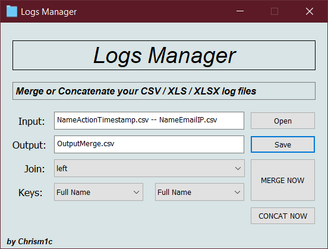
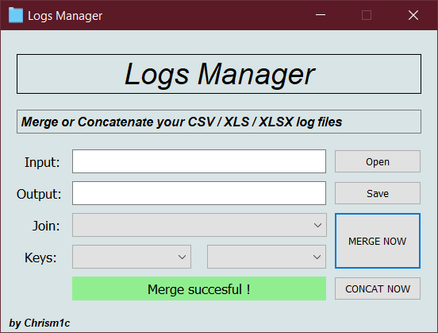
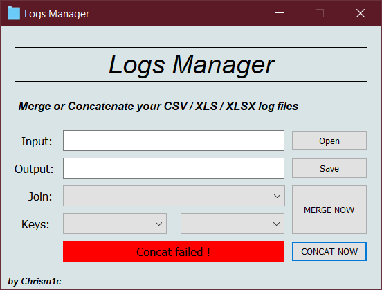

# Logs Manager
### Gui app useful to concatenete or execute a key based merge (database like) on your csv/xlsx/xls files<br>
<p align="center">
  
</p>

### Index

- [**What is Logs Manager?**](#what-is-logs-manager)
- [**System Dependencies**](#requirements-and-dependencies)
- [**Quick Start**](#quick-start)
- [**Instructions**](#instructions)
- [**Credits**](#credits)

<ul>


## What is Logs Manager?

**Logs Manager** is an application developed for a "Networks and distributed systems security" exam 
at **Univeristy Aldo Moro** of Taranto Italy. <br>
its goal is to manage log files released from different apps. 
It can be used to concatenete a large ammount of data logs spreads in different CSV/XLS/XLSX files, 
in addiction, it can allow merge two log files using a key (column name) at the same way a databases would do.

### Functionalities
<ul>

<li>
    Concatenete two or more log files : Useful to unify different files into a single one.
</li>
<li>
    Key based merge of two log files : Useful to filter records between two log files.
</li>

</ul>


<li>

## Requirements and Dependencies
```
Python 3.5.3 or higher (tested on 3.7 64bit)
pandas~=1.0.3   [python 3.5.3+]
PyQt5~=5.15.1   [python 3.5+]
xlrd
openpyxl
 ```  
	
**Resources for dependencies required** <br>
Panadas: [**pandas.pydata.org**](https://pandas.pydata.org/) <br>
PyQt5: [**pypi.org/project/PyQt5**](https://pypi.org/project/PyQt5/) <br>

</li>
<li>

## Quick Start

**Stand alone app (No Python required)**<br>
0 - Download this repository <br>
1 - Execute "LogsManager.exe"<br>
1 ALTERNATIVE - Execute "LogsManager_noConsole.vbs" (in the same dir of LogsManager.exe)<br>
2 - Good work with **Logs Manager** <br>
___
**With Python interpreter :**<br>
0 - Download this repository <br>
2 - Execute "Check and Install Python.cmd"<br>
3 - Execute "LogsManager - noConsole.vbs"<br>
3 ALTERNATIVE - Execute "LogsManager - wConsole.bat"<br>
4 - Good work with **Logs Manager** <br>


</li>
<li>


## Instructions

### Prerequisites and notes
- For CSV files, they must have first row with headers separeted by "," and all record attributes must be separeted by ","
- For XLS/XLSX files, they must have first row with headers
- All input files must have the same extension but the output file could be chosen as different one: (CSV->XLSX | XLSX->CSV)

### Concatenete Function <br> 
1 - Click on "Open" button and select 2 or more log files (CSV/XLS/XLSX) NB: they must have the same extension<br>
2 - Click on "Save" button and select name and directory of the output file (CSV/XLS/XLSX)<br>
3 - Click on "CONCAT NOW" to execute concatenation of log files<br> 

### Merge Function <br>
1 - Click on "Open" button and select 2 log files (CSV/XLS/XLSX) NB: they must have the same extension<br>
2 - Click on "Save" button and select name and directory of the output file (CSV/XLS/XLSX)<br>
3 - Select witch type of merge to execute (left,right,outer,inner)<br>
4 - Select right and left keys to execute merge (Primary Keys)<br>
5 - Click on "MERGE NOW" to execute concatenation of log files<br>

### GUI Output examples <br>

<p align="center">
  
</p>
<p align="center">
  
</p>
</li>
<li>

### Credits

**Developed and Designed by:**

[**Chrism1c**](https://github.com/Chrism1c)

</li>
</ul>

